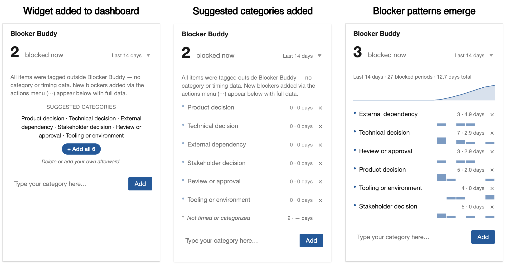

# Blocker Buddy

Blocker Buddy turns "we have a lot of blockers" into measured data.

It's faster and easier than opening the work item to add a tag manually, *and* it captures more — the category and duration of each blocked period.

Blocker Buddy answers the question your retros keep circling: not just *what was blocked or what is blocked*, but *which category of blockers eats up the most time*.



**Install. Add to team dashboard. One click to set curated suggested blocker categories. Show your team the easy way to mark blockers. A few days later, you have data that was invisible before.**

Two components are provided: a **context-menu action** to toggle an item between blocked and unblocked, and a **dashboard widget** that shows blocker activity by category over time — current count, total time blocked, and per-category breakdown with sparklines.

- **One-click bootstrap** — six blocker categories ready to add to any team, or curate your own.
- **Total time, not just count** — the breakdown sorts by total duration, so the longest-duration blockers (not the most-common ones) get attention first.
- **Honors your existing data** — items already tagged Blocked appear in the widget.
- **Native ADO team-rollup** — honors each team's configured area paths including subtree settings, so an umbrella team's dashboard can show blockers from every sub-team automatically.
- **Theme-aware** — light and dark modes track your Azure DevOps theme; no per-widget setting needed.
- **Custom work item types** — works with any work item type your process template defines (PBI, Bug, Task, Feature, Production Issue, Tech Chore — anything).
- **View by custom query** — drill from any metric to the specific work items behind it, in ADO's native query view.
- **Right-click to copy as TSV** — per-category or whole-timeframe blocker history, paste-ready for Excel or Google Sheets.

[](https://sonarcloud.io/summary/new_code?id=agileviz_blocker-buddy)

## Install

Install from the Azure DevOps Marketplace:

**[marketplace.visualstudio.com — AgileViz.BlockerBuddy ↗](https://marketplace.visualstudio.com/items?itemName=AgileViz.BlockerBuddy)**

After installation: add the Blocker Buddy widget to any team dashboard, open its configuration to add the six suggested blocker categories (one click), and start using the "Mark as blocked" right-click action on any work item.

## Documentation and support

Full documentation, configuration guide, and screenshots:
**[agileviz.com/plugins/blocker-buddy/ ↗](https://agileviz.com/plugins/blocker-buddy/)**

For bugs or feature requests, [open a GitHub issue](https://github.com/agileviz/blocker-buddy/issues) using the appropriate template.

## About this source

This repository contains the source for the Blocker Buddy VSIX published to the Marketplace by AgileViz, LLC. It's open source — MIT licensed — so customers and contributors can audit, fork, or contribute.

### Architecture

Blocker Buddy is a multi-contribution VSIX with four entry points, all pure TypeScript + DOM (no React, no chart library — same pattern as other AgileViz plugins):

- **`src/Contribs/Action/`** — the context-menu action (`ms.vss-web.action` targeting `work-item-context-menu`). High-attention, daily-use surface. Opens the block/unblock dialog.
- **`src/Contribs/Dialog/`** — the block/unblock dialog itself, opened by Action via the host dialog service.
- **`src/Contribs/Widget/`** — the dashboard widget body. Shows current blockers, total time blocked, and per-category breakdown with sparklines.
- **`src/Contribs/Config/`** — the widget configuration pane. **The single canonical home for team settings** (tag override, blocker categories vocabulary, allowMemberEdit toggle). Both Action and Widget read team config from here via `ExtensionDataService`; neither writes config.

Pure helpers live under [`src/Library/`](src/Library/) and are unit-tested without the SDK:

- `blockerBuddyLibrary.ts` — ADO REST wrappers (tags, comments, ExtensionDataService read/write)
- `blockerAggregation.ts` — pure aggregation: rolling-window counts, category totals, sparkline buckets
- `blockerEventTimeline.ts` — per-work-item blocker event reconstruction from discussion comments
- `teamConfig.ts` — team config schema + default values
- `widgetData.ts` — orchestrator: fetches work items + discussion comments, calls aggregation
- `widgetView.ts` — pure transforms over aggregated data (sort, filter, format, TSV export)

### Comment marker contract — LOCKED

Blocker Buddy writes a structured marker into each work item's Discussion comments on every block/unblock event. **The format is empirically locked** (WIQL-findable, ADO sanitizer-stable, parseable across legacy + v3 comment APIs):

| Case | Comment shape |
|---|---|
| Block | `BlockerBuddy: Blocked - PM decision` |
| Unblock | `BlockerBuddy: Unblocked (PM decision)` |

The category is the only variable in either form — drawn from each team's configured blocker vocabulary. Parser regex: `/^BlockerBuddy:\s*(Blocked|Unblocked)(?:\s*\(([^)]+)\))?(?:\s*-\s*(.+))?$/i`

**Markers are tolerant of common comment edits.** ADO's UI wraps edited comments in `<div>` tags; the parser normalizes `</div><div>` boundaries to newlines and strips outer `<div>` wrappers from each line before applying the regex. So benign edits — fixing a typo in the marker, adding a note on a new line below it — preserve the blocker history. Edits that *prepend* text or interleave content with the marker correctly fail to parse, since the marker is no longer at the start of its line.

A note on cross-project search: the WIQL `CONTAINS WORDS` query that locates BB markers across a project relies on ADO's content indexing, which may not always match HTML-wrapped (edited) comments. The per-work-item parser used by the widget and the unblock dialog is tolerant either way, so single-item flows always work; project-wide marker scans on edited comments are the only case where the underlying ADO indexing behavior matters.

Before embedding, the category is sanitized: strip `(`, `)`, newlines, tabs, leading/trailing whitespace; cap at ~300 chars. **Don't change the marker format** without re-validating against ADO's comment sanitizer and WIQL `CONTAINS WORDS` behavior — both have non-obvious edge cases (hyphens split tokens; CamelCase doesn't tokenize predictably).

### Other notes worth knowing

- Styling uses SCSS variables from `azure-devops-ui/Core/core.scss` so light/dark mode tracks the Azure DevOps theme automatically — don't reach for `@media (prefers-color-scheme: dark)`, which follows the OS rather than ADO.
- The `azure-devops-extension-sdk` and `azure-devops-extension-api/*` modules are AMD-only and crash under Jest's Node runtime. `jest.config.js` redirects them via `moduleNameMapper` to an empty stub at `src/Library/__mocks__/ado-sdk-stub.ts`.
- ADO contribution IDs use **dots, not slashes** (`ms.vss-web.action`, not `ms.vss-web/action`). Slashes silently fail to register — no console error, contribution just doesn't appear.
- Build output (`dist/`, `*.vsix`) and `node_modules/` are gitignored. The shipped VSIX is produced by `npm run build`.

## Building from source

```bash
npm install              # first-time install
npm test                 # Jest with coverage (199 tests)
npm run lint             # ESLint on src/**/*.{ts,tsx}
npm run build            # clean + production webpack build → .vsix at repo root
```

### Rebuilding shipped assets

Two visual assets in `static/` are derived files — they're committed for convenience but rebuildable from sources in `imagesrc/`.

```bash
./build-icon.sh                  # imagesrc/icon.svg → static/icon.png (512×512)
./build-marketplace-hero.sh      # imagesrc/*.png   → static/blocker-buddy-marketplace-hero.png
```

- `build-icon.sh` requires `librsvg` (`brew install librsvg`).
- `build-marketplace-hero.sh` requires ImageMagick 7+ (`brew install imagemagick`) and composites three labeled frames captured from a live ADO dashboard into a single horizontal hero image.

If you change `imagesrc/icon.svg`, also update the AgileViz Hugo site's copy of `icon.svg` at `agileviz.com/plugins/blocker-buddy/` — the support-page card renders the SVG directly from there. Same pattern for the three hero source frames if they're recaptured.

Testing changes against a real Azure DevOps organization requires installing a dev VSIX side-by-side with the production extension. The dev manifest has a different `id` and a `baseUri` pointing at `https://localhost:3000`:

```bash
npm run build:dev        # produce a dev VSIX (separate id from production)
npm run serve            # webpack-dev-server on https://localhost:3000
```

Install the dev VSIX into an ADO org you control, then iterate against `npm run serve`. **Self-signed cert acceptance is required once per browser profile:** visit `https://localhost:3000/dist/Action/Action.html` directly and accept the cert warning. Otherwise the iframe fails to load with `ERR_CERT_AUTHORITY_INVALID`, the SDK never registers the action handler, and clicks do nothing.

**Browser note:** use **Safari** for ADO widget testing against the local dev server. Chrome 130+ enforces Private Network Access (PNA) restrictions that block `dev.azure.com` from loading iframes from `localhost`, even with the correct `Access-Control-Allow-Private-Network` response headers.

## License, contributing, security

- **[LICENSE](LICENSE)** — MIT, with a Trademark Notice for "AgileViz" and AgileViz product names.
- **[CONTRIBUTING.md](CONTRIBUTING.md)** — contribution guidelines.
- **[CODE_OF_CONDUCT.md](CODE_OF_CONDUCT.md)** — Contributor Covenant v2.1.
- **[SECURITY.md](SECURITY.md)** — responsible disclosure process. Source-code reports route through GitHub Security Advisories; hosted-service reports go through the bug bounty at [agileviz.com/security/](https://agileviz.com/security/).

---

Blocker Buddy is created by **AgileViz**. The plugins each do one thing well — simplicity is a feature, not an oversight.
